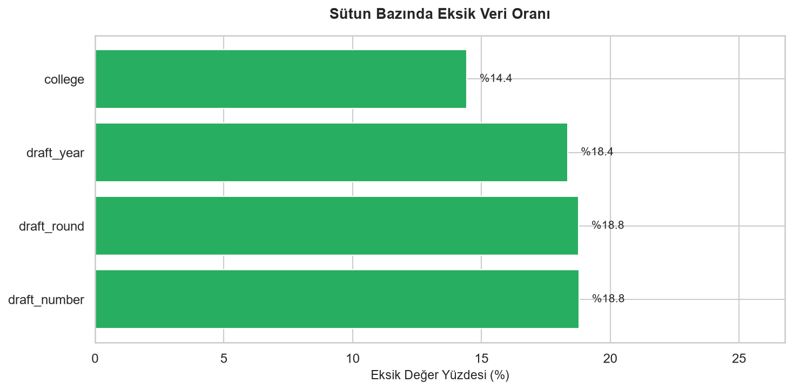
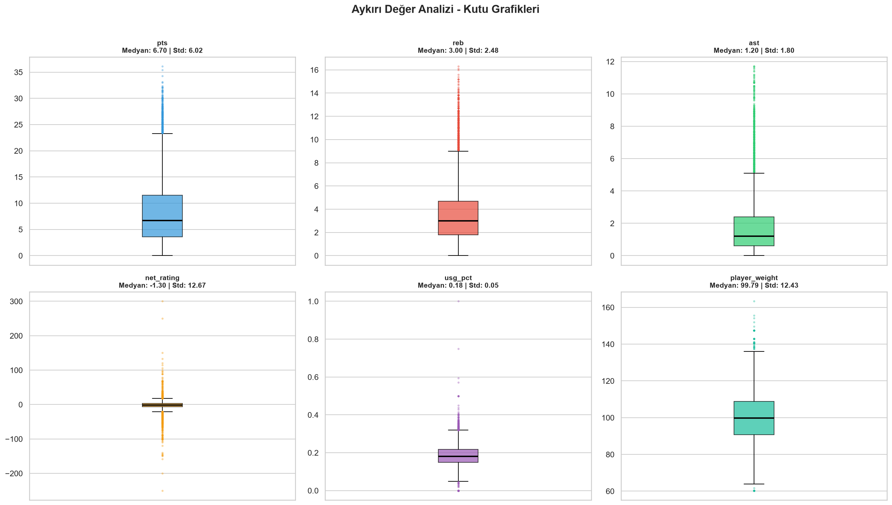
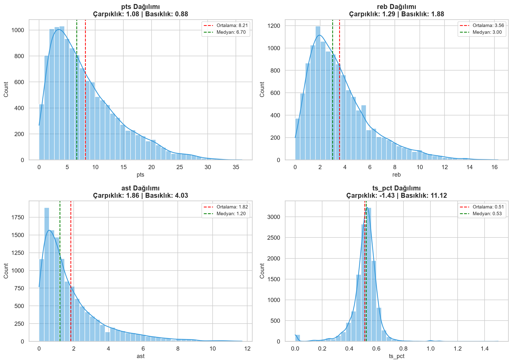
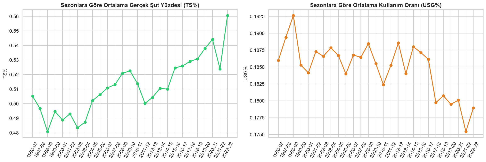
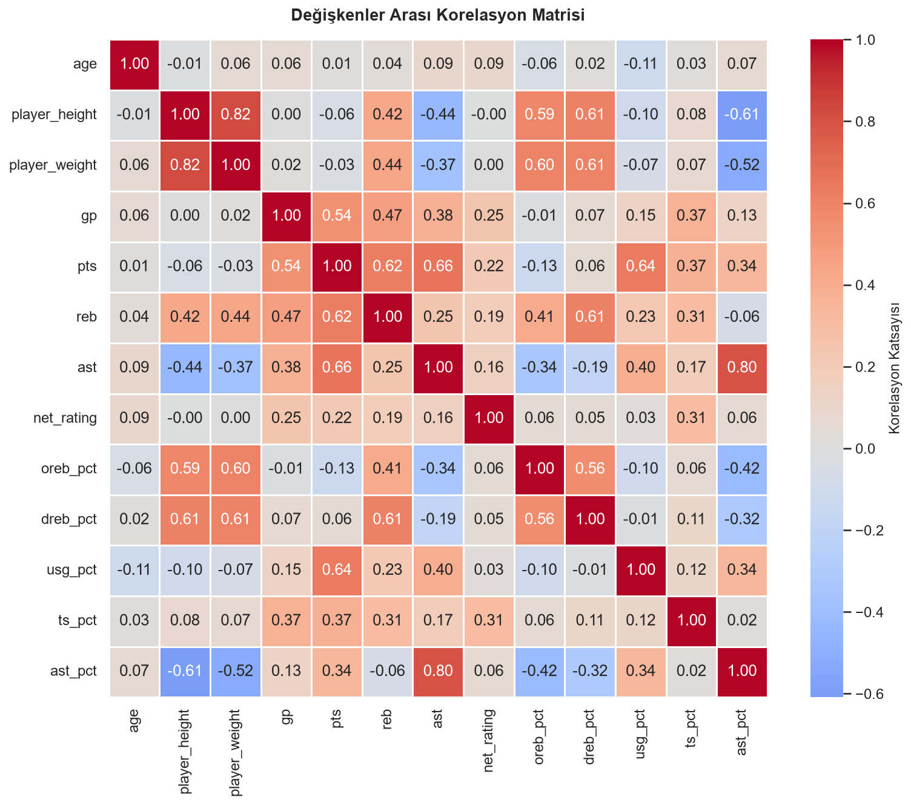
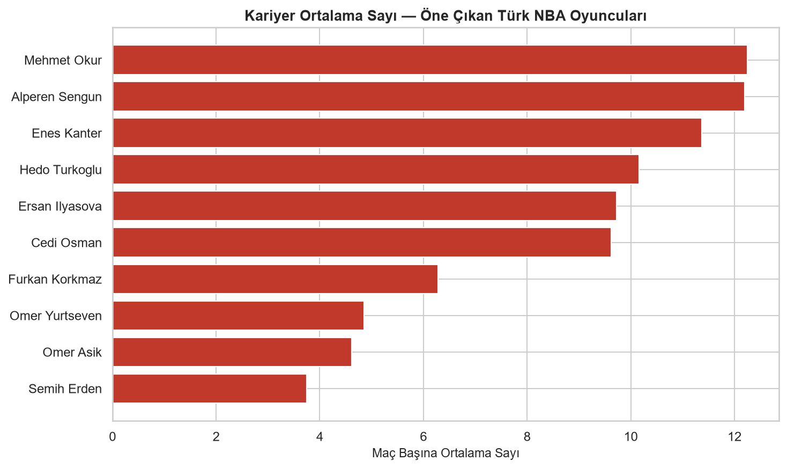

# NBA Oyuncu İstatistikleri: Keşifçi Veri Analizi ve İstatistiksel İnceleme

1996-97 ile 2022-23 sezonları arasındaki 12.844 oyuncu-sezon kaydını kapsayan bir veri seti
üzerinde uçtan uca bir keşifçi veri analizi (EDA) ve istatistiksel inceleme projesi.

Bu proje, bir veri analitiği eğitiminin kapsamı dahilinde öğrenilen Python, EDA ve istatistik
tekniklerinin gerçek bir veri seti üzerinde uygulanması amacıyla hazırlanmıştır.

## Veri Seti

- **Kaynak:** [NBA Players — Kaggle](https://www.kaggle.com/datasets/justinas/nba-players-data) (`all_seasons.csv`)
- **Boyut:** 12.844 satır × 22 sütun
- **Kapsam:** 1996-97 – 2022-23 arası 27 NBA sezonu, sezon başına oyuncu bazlı temel ve gelişmiş istatistikler (sayı, ribaund, asist, kullanım oranı, gerçek şut yüzdesi vb.) ile demografik bilgiler (yaş, boy, kilo, ülke, draft bilgisi)

## Analiz Kapsamı

- Veri temizleme ve hazırlama (`Undrafted` gibi metinsel kodların sayısal/boolean forma dönüştürülmesi)
- Eksik veri analizi (yapısal ve rastgele eksiklik ayrımı)
- Aykırı değer tespiti (IQR yöntemi)
- Dağılım analizi (çarpıklık, basıklık, Kolmogorov–Smirnov normallik testi)
- Zaman içindeki eğilimler (27 sezonluk verimlilik/kullanım oranı değişimi)
- Korelasyon analizi
- Hipotez testleri (bağımsız örneklem t-testi, Pearson korelasyonu)
- Bonus: Türkiye doğumlu NBA oyuncularının kariyer istatistikleri

Notebook: [`notebooks/nba_eda_analizi.ipynb`](notebooks/nba_eda_analizi.ipynb)

## Öne Çıkan Bulgular

- **Eksik veri:** Gerçek eksiklik yalnızca `college` sütununda (%14.4). `draft_year/round/number`
  sütunlarındaki eksiklik (~%18-19) rastgele değil — draft edilmemiş (undrafted) oyuncuları
  temsil eden yapısal bir durum.
- **NBA 27 yılda daha verimli hale geldi:** Ortalama gerçek şut yüzdesi (TS%) 1996-97'den
  2022-23'e **+5,5 puan** arttı — modern NBA'in verimlilik odaklı oyun tarzını doğruluyor.
- **Boy – ribaund ilişkisi istatistiksel olarak anlamlı:** Pearson r = 0.424 (p < 0.001).
  Medyan boyun üzerindeki oyuncular ortalama 4.59 ribaund alırken altındakiler 2.61 alıyor
  (t-testi, p < 0.001).
- **Uluslararası oyuncular ABD doğumlulara göre daha yüksek TS% ortalamasına sahip**
  (%52.9'a karşı %51.0, p < 0.001) — istatistiksel olarak anlamlı bir fark.
- **Draft edilen oyuncular edilmeyenlere göre çok daha yüksek sayı ortalamasına sahip**
  (8.98'e karşı 4.78, p < 0.001).
- Veri setinde 12 farklı Türkiye doğumlu NBA oyuncusu bulunuyor.

## Görseller

| Eksik Veri Analizi | Aykırı Değerler | Dağılımlar |
|---|---|---|
|  |  |  |

| Zaman İçindeki Eğilim | Korelasyon Matrisi | Türk Oyuncular |
|---|---|---|
|  |  |  |

## Kullanılan Araçlar

Python · pandas · NumPy · Matplotlib · Seaborn · SciPy (istatistiksel testler) · Jupyter Notebook

## Projeyi Çalıştırma

```bash
pip install -r requirements.txt
jupyter notebook notebooks/nba_eda_analizi.ipynb
```

## Proje Yapısı

```
nba-veri-analizi/
├── data/
│   └── all_seasons.csv
├── notebooks/
│   ├── nba_eda_analizi.ipynb
│   └── gorseller/
├── README.md
└── requirements.txt
```
